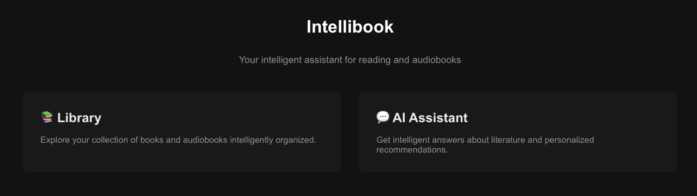
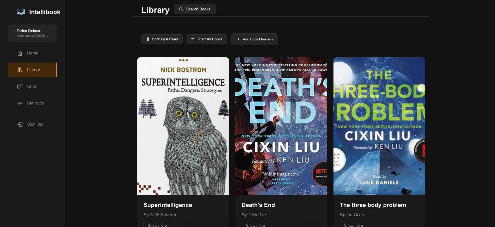
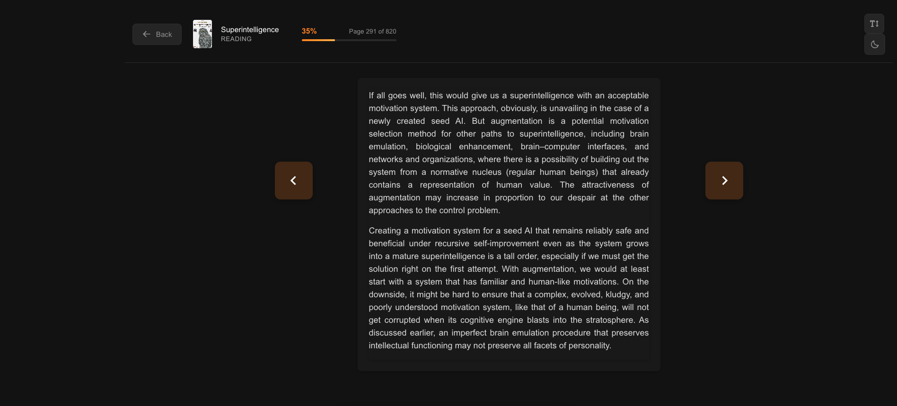
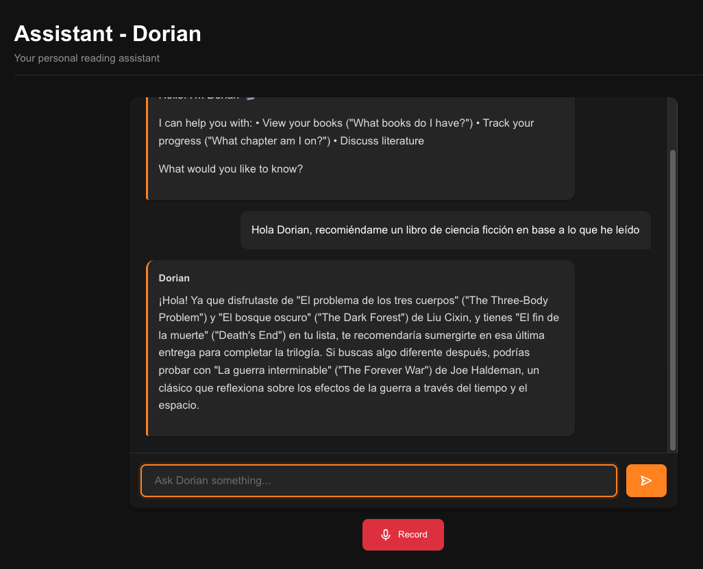
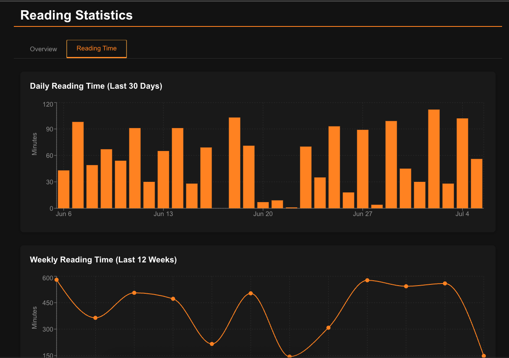

# 📚 Intellibook

> Your intelligent assistant for reading and audiobooks

Intellibook is a comprehensive book and audiobook management application that combines a powerful library organizer, an AI-powered reading assistant, and a feature-rich ebook reader. Built with modern technologies and deployed on Google Cloud Platform, it provides a seamless reading experience across all your devices.



## ✨ Features

### 📖 **Digital Library Management**
- **Organize & Manage**: Add, edit, and organize your complete collection of books and audiobooks
- **Multiple Formats**: Support for PDF, EPUB, and various audiobook formats
- **Book Information**: Store detailed metadata including cover images, descriptions, publication info
- **Status Tracking**: Track books as "To Read", "Reading", or "Read"
- **Smart Search**: Find and add new books to your library



### 📱 **Integrated Ebook Reader**
- **Pagination System**: Smart page splitting optimized for readability
- **Theme Options**: Light and dark reading modes
- **Font Controls**: Adjustable font size and content width
- **Mobile Navigation**: Touch-friendly page navigation on mobile devices
- **Progress Tracking**: Automatic bookmark saving and progress restoration



### 🤖 **AI Reading Assistant - "Dorian"**
- **Literature Expert**: Specialized AI assistant powered by Google Gemini 2.0 Flash
- **Personal Library Integration**: Answers questions about your specific book collection
- **Reading Recommendations**: Get personalized book suggestions
- **Literary Analysis**: Discuss themes, characters, and literary techniques
- **Multi-language Support**: Responds in the same language as your questions



### 📊 **Reading Analytics & Statistics**
- **Progress Tracking**: Visual charts of your reading journey
- **Reading Streaks**: Monitor your reading consistency
- **Book Statistics**: Overview of books read, in progress, and planned
- **Time Analytics**: Track daily and weekly reading time



### 🎧 **Audiobook Player**
- **Integrated Player**: Built-in audiobook player with resume functionality
- **Progress Sync**: Sync listening progress across devices
- **Cloud Storage**: Secure audiobook storage in Google Cloud

### 🔐 **Secure Authentication**
- **Google OAuth 2.0**: Secure sign-in with your Google account
- **Access Control**: Restricted access with configurable user permissions

## 🛠 Technology Stack

### Frontend
- **Framework**: Next.js 14 with TypeScript
- **Styling**: CSS Modules with responsive design
- **Charts**: Recharts for data visualization
- **Authentication**: Google OAuth 2.0
- **State Management**: React Context API

### Backend
- **Framework**: FastAPI (Python 3.11)
- **Database**: SQLite (development), Cloud SQL MySQL (production)
- **ORM**: SQLModel
- **AI Integration**: Google Gemini 2.0 Flash
- **Text-to-Speech**: Google Cloud Text-to-Speech
- **Authentication**: Google OAuth 2.0

### Google Cloud Platform
- **Compute**: Cloud Run for serverless deployment
- **Storage**: Cloud Storage and Cloud SQL
- **Security**: Secret Manager
- **CI/CD**: Cloud Build with Artifact Registry
- **AI**: Gemini AI and Text-to-Speech APIs

## 📋 Prerequisites

- **Node.js** (v18 or higher)
- **Python** (v3.11 or higher)
- **Google Cloud Account** (for production deployment)

## 🔧 Installation & Setup

### Local Development

#### 1. Clone the Repository
```bash
git clone https://github.com/yourusername/intellibook.git
cd intellibook
```

#### 2. Backend Setup
```bash
cd backend
python -m venv .venv
source .venv/bin/activate  # On Windows: .venv\Scripts\activate
pip install -r requirements.txt
```

Create `.env` file:
```env
DEBUG_MODE=True
GOOGLE_API_KEY=your_google_api_key
GOOGLE_CLIENT_ID=your_google_client_id
FRONTEND_URL=http://localhost:3000
```

#### 3. Frontend Setup
```bash
cd frontend
npm install
```

Create `.env.local` file:
```env
NEXT_PUBLIC_API_URL=http://localhost:8000
NEXT_PUBLIC_GOOGLE_CLIENT_ID=your_google_client_id
```

#### 4. Start Development Servers
```bash
# Backend
cd backend && python main.py

# Frontend (in another terminal)
cd frontend && npm run dev
```

Access the application at `http://localhost:3000`

---

**Created with ❤️ by Tadeo Deluca**